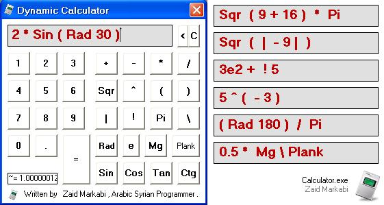



## Dynamic Calculator

### Description

Dynamic Calculator , nice application let you to write any mathematical sentences..

and support many constants..

see screenshot and download it now..
 
### More Info
 

             |
---                |---
**Submitted On**   |2009-04-16 22:41:56
**By**             |[Zaid Markabi](https://github.com/Planet-Source-Code/PSCIndex/blob/master/ByAuthor/zaid-markabi.md)
**Level**          |Advanced
**User Rating**    |4.8 (24 globes from 5 users)
**Compatibility**  |VB 5\.0, VB 6\.0
**Category**       |[Complete Applications](https://github.com/Planet-Source-Code/PSCIndex/blob/master/ByCategory/complete-applications__1-27.md)
**World**          |[Visual Basic](https://github.com/Planet-Source-Code/PSCIndex/blob/master/ByWorld/visual-basic.md)
**Archive File**   |[Dynamic\_Ca215181582009\.zip](https://github.com/Planet-Source-Code/zaid-markabi-dynamic-calculator__1-72072/archive/master.zip)

